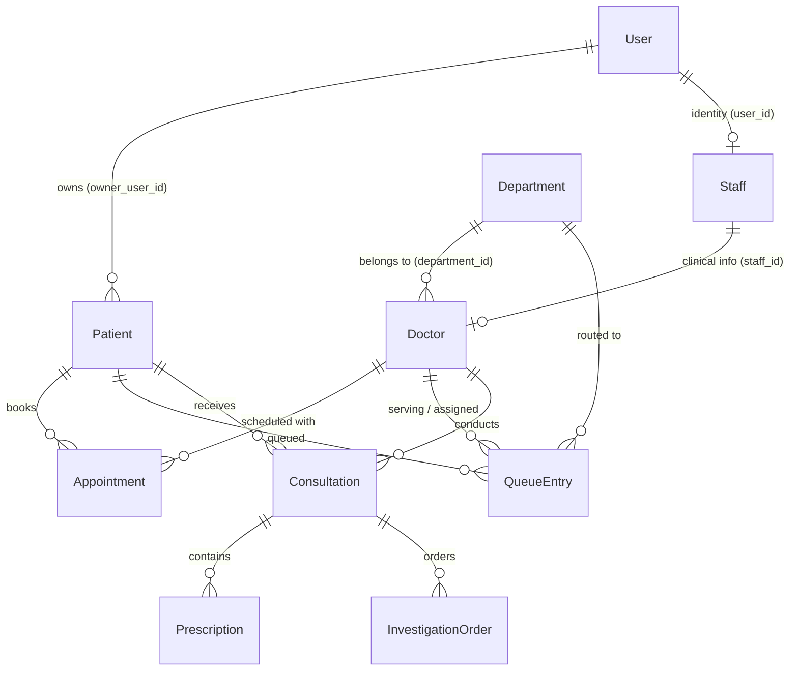

# MediQ - Database Schema & Data Dictionary

**Smart India Hackathon (SIH 2026)**  
**Database Engine:** PostgreSQL (UUID primary keys generated via `gen_random_uuid()`)

---

## 1. Schema Overview & Entity Relationship Diagram

---

## 2. Table Specifications

### 2.1 `User` Table (Core Account & Authentication)
| Column | Type | Constraints | Description |
|---|---|---|---|
| `id` | UUID | PK, DEFAULT `gen_random_uuid()` | Unique user account ID |
| `name` | VARCHAR(255) | NOT NULL | User display name |
| `email` | VARCHAR(255) | UNIQUE, NOT NULL | Account email address |
| `password` | VARCHAR(255) | NOT NULL | Bcrypt password hash |
| `role` | VARCHAR(50) | DEFAULT `'USER'` | Top-level system role (`USER`, `STAFF`, `ADMIN`) |
| `created_at` | TIMESTAMP | DEFAULT `CURRENT_TIMESTAMP` | Account creation timestamp |

### 2.2 `Department` Table (Hospital Clinical Units)
| Column | Type | Constraints | Description |
|---|---|---|---|
| `id` | UUID | PK, DEFAULT `gen_random_uuid()` | Unique department ID |
| `name` | VARCHAR(100) | UNIQUE, NOT NULL | Department name (e.g. Cardiology) |
| `description` | TEXT | NULLABLE | Department description |
| `created_at` | TIMESTAMP | DEFAULT `CURRENT_TIMESTAMP` | Timestamp |

*Pre-seeded Departments:* General Medicine, Cardiology, Pediatrics, Orthopedics, Dermatology, Neurology, Radiology, Pathology.

### 2.3 `Staff` Table (Hospital Employment Profile)
| Column | Type | Constraints | Description |
|---|---|---|---|
| `id` | UUID | PK, DEFAULT `gen_random_uuid()` | Unique staff member ID |
| `user_id` | UUID | FK -> `User(id)` ON DELETE CASCADE, UNIQUE | Linked user account |
| `employee_code`| VARCHAR(50) | UNIQUE, NOT NULL | Unique hospital employee code |
| `role` | VARCHAR(50) | NOT NULL | `DOCTOR`, `NURSE`, `RECEPTIONIST`, `LAB_STAFF`, `PHARMACIST` |
| `status` | VARCHAR(50) | DEFAULT `'ACTIVE'` | `ACTIVE`, `INACTIVE`, `ON_LEAVE` |
| `created_at` | TIMESTAMP | DEFAULT `CURRENT_TIMESTAMP` | Creation timestamp |

### 2.4 `Doctor` Table (Clinical Specialist Profile)
| Column | Type | Constraints | Description |
|---|---|---|---|
| `id` | UUID | PK, DEFAULT `gen_random_uuid()` | Unique doctor profile ID |
| `staff_id` | UUID | FK -> `Staff(id)` ON DELETE SET NULL, UNIQUE | Linked hospital staff record |
| `department_id`| UUID | FK -> `Department(id)` ON DELETE SET NULL | Assigned department |
| `specialization`| VARCHAR(255) | NOT NULL | Medical specialty (e.g. Cardiology) |
| `license_number`| VARCHAR(100)| NULLABLE | Medical registration / license number |
| `name` | VARCHAR(255) | NULLABLE | Historical / cached name |
| `email` | VARCHAR(255) | NULLABLE | Historical / cached email |
| `password` | VARCHAR(255) | NULLABLE | Legacy credentials (fallback) |
| `department` | VARCHAR(255) | NULLABLE | Legacy department text |
| `created_at` | TIMESTAMP | DEFAULT `CURRENT_TIMESTAMP` | Profile creation timestamp |

### 2.5 `Patient` Table (Clinical Profiles)
| Column | Type | Constraints | Description |
|---|---|---|---|
| `id` | UUID | PK, DEFAULT `gen_random_uuid()` | Unique clinical profile ID |
| `owner_user_id`| UUID | FK -> `User(id)` ON DELETE CASCADE | Managing user account |
| `name` | VARCHAR(255) | NOT NULL | Patient legal name |
| `age` | INT | NOT NULL | Patient age |
| `gender` | VARCHAR(50) | NOT NULL | `Male`, `Female`, `Other` |
| `patient_type` | VARCHAR(50) | DEFAULT `'Online'` | Intake channel (`Online`, `Walkin`) |
| `doctor_id` | UUID | FK -> `Doctor(id)` ON DELETE SET NULL | Primary assigned doctor (if any) |
| `created_at` | TIMESTAMP | DEFAULT `CURRENT_TIMESTAMP` | Record creation timestamp |

### 2.6 `Appointment` Table (Scheduled Consultations)
| Column | Type | Constraints | Description |
|---|---|---|---|
| `id` | UUID | PK, DEFAULT `gen_random_uuid()` | Unique appointment ID |
| `patient_id` | UUID | FK -> `Patient(id)` ON DELETE CASCADE | Patient booked for consultation |
| `doctor_id` | UUID | FK -> `Doctor(id)` ON DELETE CASCADE | Attending doctor |
| `start_time` | TIMESTAMP | NOT NULL | Appointment slot start |
| `end_time` | TIMESTAMP | NOT NULL | Appointment slot end |
| `status` | VARCHAR(50) | DEFAULT `'SCHEDULED'` | `SCHEDULED`, `CONFIRMED`, `COMPLETED`, `CANCELLED` |
| `type` | VARCHAR(50) | DEFAULT `'CONSULTATION'` | `CONSULTATION`, `FOLLOW_UP`, `EMERGENCY`, `ROUTINE` |
| `created_at` | TIMESTAMP | DEFAULT `CURRENT_TIMESTAMP` | Booking timestamp |

### 2.7 `QueueEntry` Table (Unified Dynamic Queue)
| Column | Type | Constraints | Description |
|---|---|---|---|
| `id` | UUID | PK, DEFAULT `gen_random_uuid()` | Unique queue ticket ID |
| `patient_id` | UUID | FK -> `Patient(id)` ON DELETE CASCADE | Patient in queue |
| `doctor_id` | UUID | FK -> `Doctor(id)` ON DELETE SET NULL | Doctor assigned to queue |
| `department_id`| UUID | FK -> `Department(id)` ON DELETE SET NULL | Department queue |
| `appointment_id`| UUID| FK -> `Appointment(id)` ON DELETE SET NULL | Linked appointment (if applicable) |
| `type` | VARCHAR(50) | DEFAULT `'WALK_IN'` | `APPOINTMENT`, `WALK_IN`, `EMERGENCY` |
| `status` | VARCHAR(50) | DEFAULT `'WAITING'` | `WAITING`, `CALLED`, `SERVING`, `COMPLETED`, `SKIPPED`, `CANCELLED` |
| `priority` | INT | DEFAULT `0` | Dynamic priority (Emergency = 10+, Appt = 5, Walk-in = 1) |
| `scheduled_time`| TIMESTAMP| NULLABLE | Slot time for appointments |
| `joined_at` | TIMESTAMP | DEFAULT `CURRENT_TIMESTAMP` | Queue arrival timestamp |
| `started_at` | TIMESTAMP | NULLABLE | Consultation start timestamp |
| `completed_at`| TIMESTAMP | NULLABLE | Completion or skip timestamp |
| `created_at` | TIMESTAMP | DEFAULT `CURRENT_TIMESTAMP` | Record creation timestamp |

### 2.8 Clinical Records Tables
- **`Consultation`**: `doctor_id`, `patient_id`, `appointment_id`, `diagnosis`, `notes`, `treatment_plan`.
- **`Prescription`**: `consultation_id`, `patient_id`, `doctor_id`, `medication`, `dosage`, `frequency`, `duration`, `instructions`.
- **`InvestigationOrder`**: `patient_id`, `doctor_id`, `test_name`, `instructions`, `status`, `result`.

### 2.9 `Admin` Table (Platform Administrators)
| Column | Type | Constraints | Description |
|---|---|---|---|
| `id` | UUID | PK, DEFAULT `gen_random_uuid()` | Admin user ID |
| `name` | VARCHAR(255) | NOT NULL | Admin full name |
| `email` | VARCHAR(255) | UNIQUE, NOT NULL | Admin login email |
| `password` | VARCHAR(255) | NOT NULL | Bcrypt password hash |
| `created_at` | TIMESTAMP | DEFAULT `CURRENT_TIMESTAMP` | Creation timestamp |

---

## 3. Schema Migrations & Idempotency

Database schema initialization is managed through [`projectSchema.ts`](file:///home/rishank/Documents/projects/hospital-flow/apps/api/src/database/projectSchema.ts). The schema executes idempotently on server start:
- DDL uses `CREATE TABLE IF NOT EXISTS`.
- Column migrations use `ALTER TABLE ... ADD COLUMN IF NOT EXISTS`.
- Constraints are relaxed safely where legacy columns were deprecated.
- Standard departments are seeded with `ON CONFLICT DO NOTHING`.
